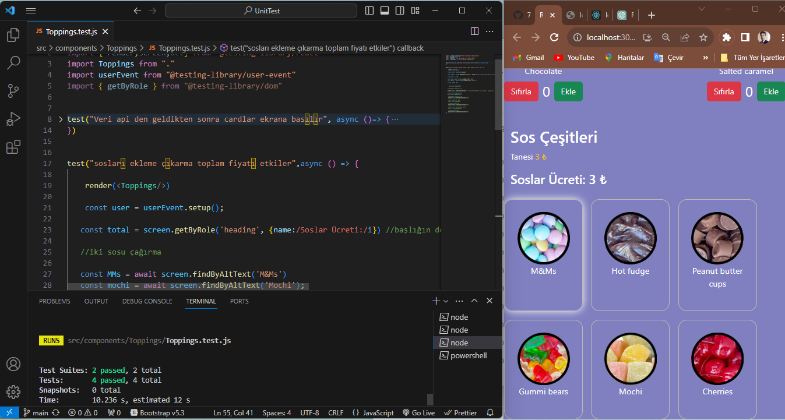

# Unit Test

basit bir dondurma uygulamasının tüm bileşenlerin unit testi yazıldı.

- bir dom elemanı ekrana asekron olarak basılıyor ise find metodları değilse get metodları kulanılarak çağrılır.
- herbir unit testte bir özelliği kontrol etmeye çalışılır

### bir bişelen test edilirken sırarı ile

1. önce test edilecek bileşen import edilir.
2. test() metodu ile test edilecek özellik test edilir. iki parametre alır.
   2.1. Test edilecek özeliğin tarifi string değerler arasına detaylı bir şekilde yazılır.
   2.2. testi gerçekleştirecek fonksiyon yazılır.
   test edilecek bileşen test metodu içerisinde öncelikli olarak render edilir
3. Bir butona tıklama gibi kullanıcı girişleri için user üretilir.
   ` const user =userEvent.setup()`

```javascript
test("Veri api den geldikten sonra cardlar ekrana basılır", async () => {
  render(<Toppings />);

  const images = await screen.findAllByRole("img"); // resimler asekron olarak geldiği için find metodunu kulandık

  expect(images.length).toBeGreaterThanOrEqual(1);
});
```

4. dom elemanları bir çok özelliğine göre çağrılabilir.

```javascript
const orderButton = screen.getByRole("button");
const popUp = screen.getByText("Size gerçekten bir şey", { exact: false }); // metin %100 uysun mu
const total = screen.getByTestId("total");
const buttons = await screen.findAllByRole("button", { name: "Ekle" });
 const total = screen.getByRole('heading', {name:/Soslar Ücreti:/i}) //başlığın devamı değişebileceği için bu şekilde yapıldı
 const MMs = await screen.findByAltText('M&Ms')
```
5. npm run test şeklide terminal den yazıdığız testlerin geçip geçmediği kontrol edilir.

uyarı: axios sürümlerinde hata çıkabiliyor


